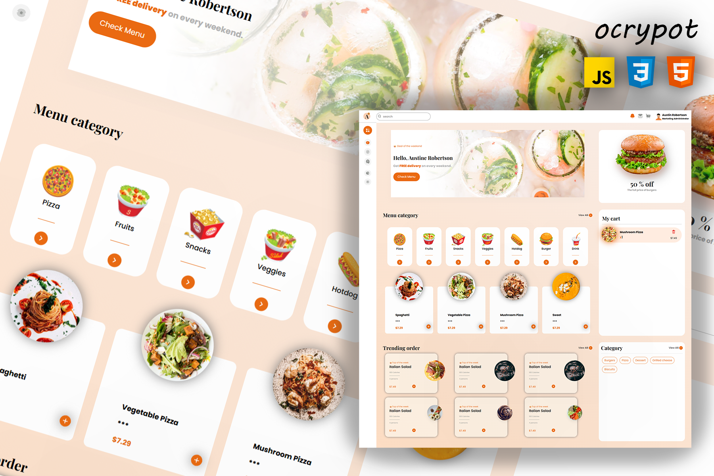
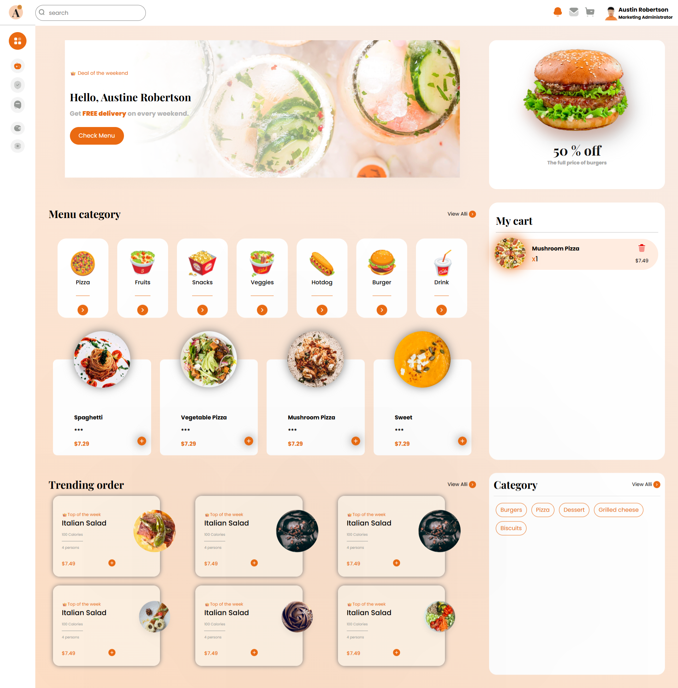
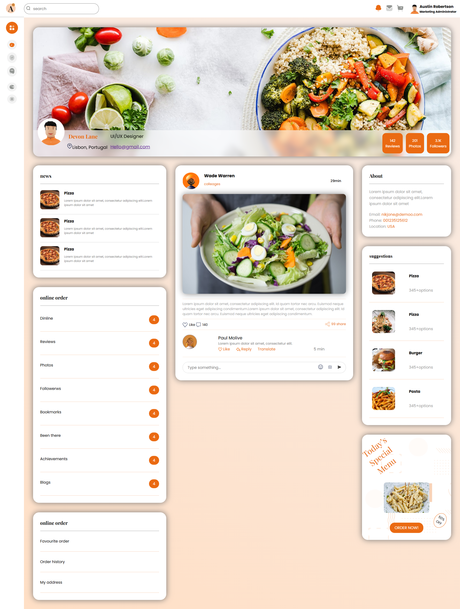
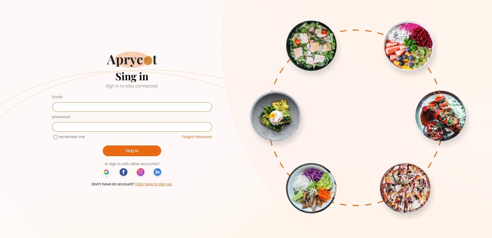

# ocrypot
This is a website for a restaurant. The website is written in HTML, CSS, and JS.
This site was built according to the aforementioned design in Figma.

<a href="https://www.figma.com/design/nb0AdFBL3u4ngmLMKhnBDM/Aprycot-Lite-%E2%80%93-Free-Restaurant-HTML5-Admin-Dashboard-Template--Community-?m=auto&t=ErTANcQvEDpXui7U-7">The link of Figma</a>

# Cover

# photos
  - Index
  

  - Profile
  

  - Account
  

  - 404 ERROR!
  
